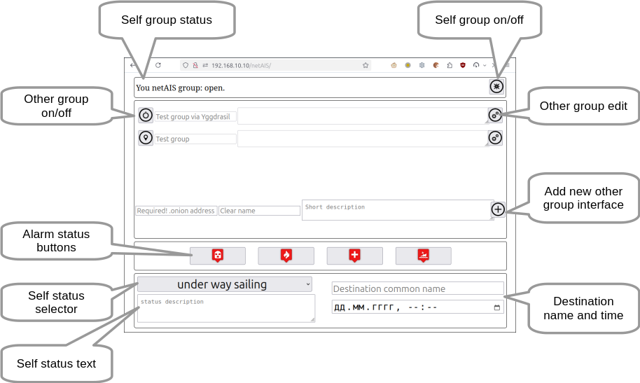

[Русское описание](README.ru-RU.md)  
# netAIS 

## v.2

Exchange AIS-like messages via the Internet to watch position members of your private group. No need for a dedicated server with a real IP address.  
Suitable for fishing, regatta, collective trips and water recreation.  

   
The software is a set of daemons (servers) running on a user's computer under Linux OS. Software use [TOR](torproject.org) as a communication environment, so it works smoothly via mobile internet and public wi-fi. Spatial info gets from [gpsd](https://gpsd.io/) or [SignalK](https://signalk.org/).  
netAIS messages can be accepted via lan by any AIS-compatible device or software.

## Features
* Service one private group.
* Membership in any number of groups.
* Broadcast to a group: position, standard status (under way, at anchor, etc.), free status text, destination, alarms and MOB. Of course, non-standard features for AIS are not displayed by the usual AIS tools, but the [GaladrielMap](http://galadrielmap.hs-yachten.at/) displays everything.
* English, Russian or other language web interface.

## Technical
Any of the software kits has a client and a server for one private group. The server can be configured as a TOR hidden service.  
You must get .onion address of this hidden service in any way - by email, SMS or pigeon post, and configure the client with it.  
The client calls to the server with spatial and other info in AIS-like format. Server return info about all of the group members.  
This info puts to file and available via tcp socket and may be got asynchronously.  
Info is a JSON encoded array with MMSI keys and an array of data as value. The data are key-value pair as described in gpsd/www/AIVDM.adoc (if you have gpsd) or [e-Navigation Netherlands](http://www.e-navigation.nl/system-messages) site, except:

* The units of measurement are given in the human species
* The timestamp  is a Unix timestamp

The [GaladrielMap](http://galadrielmap.hs-yachten.at/) chart plotter receives netAIS info via [gpsdPROXY](https://github.com/VladimirKalachikhin/gpsdPROXY). For the others has a daemon that cast info as standard AIS flow.

Using the TOR as a transport ensures simplicity and security. However, the system can work over mesh networks (as the Yggdrasil, for example) or over the real Internet. In this case, it is necessary to take care of security by conventional methods.

## Demo
Public group for testing:  
**2q6q4phwaduy4mly2mrujxlhpjg7el7z2b4u6s7spghylcd6bv3eqvyd.onion**  
~~All active group members are visible on [GaladrielMap](http://galadrielmap.hs-yachten.at/) [Live demo](http://130.61.159.53/map/)~~.  
Unfortunately, the Oracle Inc. turned out to be a crook, so the demo does not work.

## Compatibility
Linux, PHP7. 

## Dependencies
php-curl

## Install&configure:
You must have a web server under Linux with php support and [TOR service](https://www.torproject.org/docs/tor-manual.html.en).  
Copy the project files to a web server directory and adjust paths in _params.php_.  
Set _write_ access to `data/` and `server/` directories for web server user (www-data?).  
[Configure TOR hidden service](https://www.torproject.org/docs/tor-onion-service.html.en) to `server/` directory if you are going to support a corporate group. It's no need if you want to be a group member only.  
The address of the TOR hidden service is located in `hostname` file, as it described in `torrs`. (for example: `# cat /var/lib/tor/hidden_service_netAIS/hostname` )  
Update _params.php_ to address and port of AIS cast daemon, if need, in $netAISdHo and $netAISdPort variables.

### Vehicle info
The information abou you vehicle stored in _boatInfo.ini_ file. Fill it correctly.

### Spatial info
Usually, netAIS client gets your positioning from [gpsd](https://gpsd.io/) or [gpsdPROXY](https://github.com/VladimirKalachikhin/gpsdPROXY) instance on your server. How to install and configure gpsd see [gpsd pages](https://gpsd.io/). gpsdPROXY must be worked if you use [GaladrielMap](http://galadrielmap.hs-yachten.at/). Update _params.php_ to gpsd host and port, if you want.  
Another way gets spatial info is a [SignalK](https://signalk.org/) infrastructure. netAIS client will try found the SignalK service on your local network, and get a position from it. 
However, it is better to set the [SignalK](https://signalk.org/) server address in _params.php_.  

## Usage
The netAIS data may be received as:  

* local file with name `$netAISJSONfilesDir/group_address.onion`. The $netAISJSONfilesDir option is set in _params.php_. Full-featured, include user-defined status messages.
* via [gpsdPROXY](https://github.com/VladimirKalachikhin/gpsdPROXY). Easiest, recommended. Just set _*$netAISgpsdHost* *$netAISgpsdPort* in _params.php_to gpsdPROXY. gpsdPROXY will return netAIS data as well. Full-featured too.
* network socket with gpsd:// protocol. Available broadcast imo, vin, custom shiptype and custom status text.
* network socket with the flow of AIS sentences 18,24 and 27. Suitable for [OpenCPN](https://opencpn.org/), [OruxMaps](https://www.oruxmaps.com/cs/es), [SignalK](https://signalk.org/) and an iron chart plotters. Base features only.

Network socket serve by the separate daemon, disabled by default. Enable it in _params.php_ and open the web interface.
 
### Configure OpenCPN
Create a network connection as described in [OpenCPN manual](https://opencpn.org/wiki/dokuwiki/doku.php?id=opencpn:opencpn_user_manual:options_setting:connections#add_a_network_connection).  
Specify Protocol as TCP.
Specify Address and DataPort as in netAIS _params.php_.  
 

### Configure OruxMaps
Click right 'more' optin in top menu.  
Go to **Global settings** -> **Sensors** -> **AIS (nautical)**  
Check **Enable AIS**, set **GPS-AIS-NMEA source** to IP.  
Set **AIS IP address** as in netAIS _params.php_.  
After this turn on the showing AIS targets:  
Click 'tracks' option in top menu.  
Select **Sensors** -> **Start AIS**

### Configure SignalK
Jast add "Server -> Data Connections" with:  
Data Type: NMEA0183  
NMEA 0183 Source: TCP Client  
Host: {Value of $netAISdHost from _params.php_, localhost by default}  
Port: {Value of $netAISdPort from _params.php_, 3838 by default}  
but for the SignalK there is [a full-featured plugin](https://www.npmjs.com/package/netais).

## Web interface
in the `http://you-web-server/netAIS/` address:  
   
Web interface allows you to control: 

* Open/close your private group (server On/Off) - the first section of the screen.
* Configure membership and start/stop watch on other groups - middle section.
* Set your own status and the message to bring - bottom section. Do not forget to update the status at least as often as specified in the $selfStatusTimeOut parameter of params.php. If the status is not updated within the specified time, the netAIS will switch off.

Web interface optimised to mobile and/or e-Inc devices, old ones including.  
If you are not using TOR, do not forget to configure your web server to prevent access to the web interface from outside.

## Thanks
* [Aaron Gong Hsien-Joen](https://github.com/ais-one/phpais) for AIS encoder
* [Metrize Icons by Alessio Atzeni](https://icon-icons.com/pack/Metrize-Icons/1130) for icons.

## Support
[Discussions](https://github.com/VladimirKalachikhin/Galadriel-map/discussions)

The forum will be more lively if you make a donation [via PayPal](https://paypal.me/VladimirKalachikhin)  at [galadrielmap@gmail.com](mailto:galadrielmap@gmail.com) or at [ЮMoney](https://yasobe.ru/na/galadrielmap)

[Paid personal consulting](https://kwork.ru/it-support/20093939/galadrielmap-installation-configuration-and-usage-consulting)  
