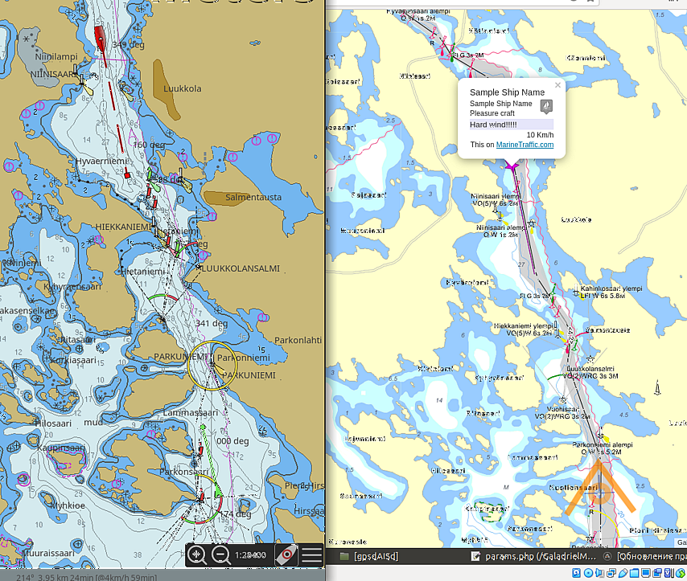
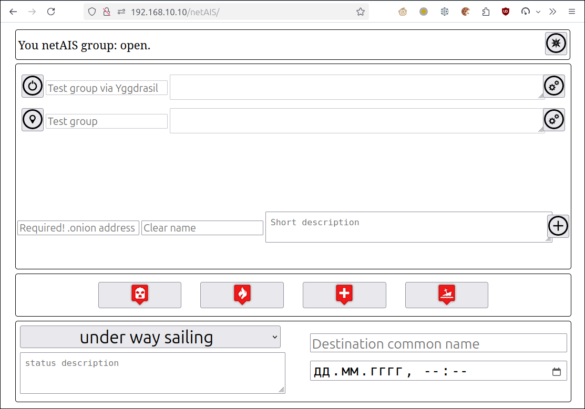

# netAIS 

## v. 1.0

Exchange AIS-like messages via the Internet to watch position members of your private group. No need to a dedication server with a real IP address.  
Suitable for fishing, regatta and collective water recreation.  

   
Software use [TOR](torproject.org) as a communication environment, so it works smoothly via mobile internet and public wi-fi. Spatial info gets via [gpsd](https://gpsd.io/).  
netAIS messages can be accepted by any AIS-compatible device or software.

## Features
* Serving one private group.
* Membership in any number groups.
* English and Russian web-interface.

## Technical
Any of the software kit has a client and a server for one private group. The server must be configured as a TOR hidden service.  
You must get .onion address of this hidden service by anyway - by email, SMS or pigeon post, and configure the client with it.  
The client calls to the server with spatial and other info in AIS-like format. Server return info about all group members.  
This info puts to file and may be got asynchronously.  
Info is a JSON encoded array with MMSI keys and an array of data as value. The data are key-value pair as described in gpsd/www/AIVDM.adoc (if you have gpsd) or [e-Navigation Netherlands](http://www.e-navigation.nl/system-messages) site, except:

* The units of measurement are given in the human species
* The timestamp  is Unix timestamp

The [GaladrielMap](http://galadrielmap.hs-yachten.at/) chart plotter receives netAIS info directly from the file. For the others has a daemon that cast info as standard AIS flow.

Also, this file format identical  [gpsdAISd](https://github.com/VladimirKalachikhin/gpsdAISd) file format.

## Demo
Public group for additions:  
**2q6q4phwaduy4mly2mrujxlhpjg7el7z2b4u6s7spghylcd6bv3eqvyd.onion**  
All active group members are visible on  [GaladrielMap](http://galadrielmap.hs-yachten.at/) [Live demo](http://130.61.159.53/map/).

## Compatibility
Linux. 

## Dependencies
php-curl

## Install&configure:
You must have a web server under Linux with php support and [TOR service](https://2019.www.torproject.org/docs/tor-manual.html.en).  
Copy the project files to a web server directory and adjust paths in _params.php_.  
Set _write_ access to `data/` and `server/` directories for web server user (www-data?).  
[Configure TOR hidden service](https://2019.www.torproject.org/docs/tor-onion-service.html.en) to `server/` directory if you are going to support a corporate group. It's no need if you want to be a group member only.  
Update _params.php_: place to $onion variable address you TOR hidden service. This address located in `hostname` file, as it described in `torrs`. (for example: `# cat /var/lib/tor/hidden_service_netAIS/hostname`)  
Update _params.php_ to address and port of AIS cast daemon, if need, in $netAISdHo and $netAISdPort variables.

### Vehicle info
The information abou you vehicle stored in _boatInfo.ini_ file. Fill it correctly.

### Spatial info
netAIS get your positioning from gpsd instance.
How to install and configure gpsd see [gpsd pages](https://gpsd.io/). Update _params.php_ to gpsd host and port, if you want.

## Usage
The netAIS data may be received as:  

* local file. This way uses [GaladrielMap](http://galadrielmap.hs-yachten.at/) chart plotter. Full featured.
* network socket with gpsd:// protocol. Available broadcast imo, vin, custom shiptype and custom status text.
* network socket with the flow of AIS sentences 18,24 and 27. Suitable for [OpenCPN](https://opencpn.org/), [OruxMaps](https://www.oruxmaps.com/cs/es) and an iron chart plotters. Base features only.  
 
### Configure OpenCPN
Create a network connection as described in [OpenCPN manual](https://opencpn.org/wiki/dokuwiki/doku.php?id=opencpn:opencpn_user_manual:options_setting:connections#add_a_network_connection).  
Specify Protocol as TCP.
Specify Address and DataPort as in netAIS _params.php_.  
 

### Configure OruxMaps
Click right 'more' optin in top menu.  
Go to **Global settings** -> **Sensors** -> **AIS (nautical)**  
Check **Enable AIS**, set **GPS-AIS-NMEA source** to IP.  
Set **AIS IP address** as in netAIS _params.php_.  
After this turn on the showing AIS targets:  
Click 'tracks' option in top menu.  
Select **Sensors** -> **Start AIS**

## Web-interface
   
Web-interface allows you to control: 

* Open/close your private group (server On/Off) - the first section of the screen.
* Configure membership and start/stop watch on other groups - middle section.
* Set your own status and the message to bring - bottom section.

Web-interface optimised to mobile and/or e-Inc devices, old ones including.

## Thanks
* [Aaron Gong Hsien-Joen](https://github.com/ais-one/phpais) for AIS encoder
* [Metrize Icons by Alessio Atzeni](https://icon-icons.com/pack/Metrize-Icons/1130) for icons.

## Support
You can get support for netAIS software for a beer [via PayPal](https://paypal.me/VladimirKalachikhin) or [YandexMoney](https://yasobe.ru/na/galadrielmap) at [galadrielmap@gmail.com](mailto:galadrielmap@gmail.com)  