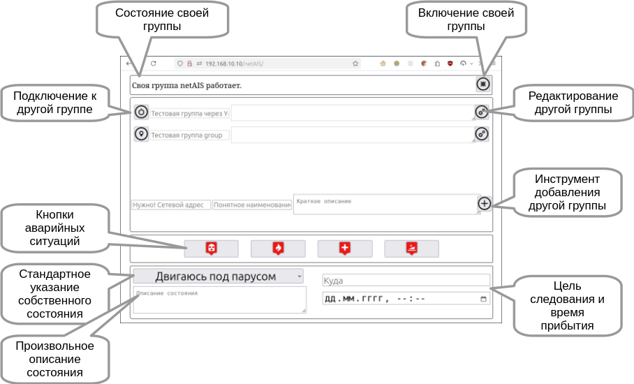

[In English](README.md)  
# netAIS 

## v.2
Обмен AIS-подобными сообщениями с координатами и сопутствующей информацией через Интрнет между участниками выделенной закрытой группы. Для взаимодействия не требуется интернет-сервер с реальным адресом.

Удобно для организации коллективного плавания, соревнований, рыбалки.

   

Программное обеспечение представляет собой набор демонов (серверов), функционирующих на компьютере под управлением Linux. Используется [TOR](torproject.org) как среда коммуникации, и обмен информацией происходит и через мобильный интернет и через публичные точки доступа wi-fi без дополнительных настроек.  
Собственные координаты программное обеспечение получает от [gpsd](https://gpsd.io/), [gpsdPROXY](https://github.com/VladimirKalachikhin/gpsdPROXY) или [SignalK](https://signalk.org/).

Сообщения netAIS могут быть восприняты любым оборудованием или программным обеспечением, принимающим сообщения AIS из локальной сети tcp/ip.

Этот код написан без использования ИИ, "лучших практик", ООП и ЕСР.

## Возможности
* Создание одной выделенной группы
* Участие в любом количестве выделенных групп
* Рассылается в группу: положение, стандартная информация о состоянии (в движении, на якоре, и т.п.), произвольная информация о состоянии, цель следования и время прибытия, аварийная ситуация и ситуация "человек за бортом". Разумеется, обычные средства отображения AIS не смогут отобразить нестандартную информацию, но [GaladrielMap](http://galadrielmap.hs-yachten.at/) показывает всё.
* Веб-интерфейс на русском, английском или другом языке

## Технические детали
Комплект программного обеспечения содержит клиентскую часть -- собственно для обмена сообщениями, и серверную часть, обеспечивающую эту возможность. Один сервер обслуживает одну выделенную группу и обычно является скрытым сервисом TOR.  Если вы хотите организовать собственную группу, .onion адрес этого сервиса надо передать потенциальным членам группы каким-нибудь сторонним способом -- в sms, электронной или голубиной почтой. Каждый член вашей группы указывает этот адрес в своём клиенте, и клиент получает возможность обмениваться информацией с сервером через сеть TOR. В адресах обычного интернета нет необходимости.

Клиент сохраняет полученные от сервера сведения обо всех членах группы в файл. Файл может независимо считываться каким-то другим программным обеспечением для отображения на экране. Кроме файла, информацию можно получить из tcp socket по протоколу [gpsd](https://gpsd.io/) или в виде потока сообщений AIS.  
Информация в файле представляет собой закодированный в JSON ассоциированный массив, где ключ -- это mmsi плавсредства, а значение -- ассоциированный массив AIS характеристик, как они описаны в gpsd/www/AIVDM.adoc (если у вас установлен gpsd) или на сайте [e-Navigation Netherlands](http://www.e-navigation.nl/system-messages), за исключением:  

* Все единицы измерения приведены к общепринятым
* Метка времени является временем Unix

Картплотер [GaladrielMap](http://galadrielmap.hs-yachten.at/) получает информацию netAIS через [gpsdPROXY](https://github.com/VladimirKalachikhin/gpsdPROXY), который обращается за ней через сетевой соктет по протоколу gpsd. Другое программное и аппаратное обеспечение может просто получать поток стандартных сообщений AIS.

Использования TOR в качестве транспорта даёт простоту использования и защищённость. Однако, система может работать и через mesh-сеть (типа Yggdrasil), и через реальный Интернет, при наличии реальных адресов. В этом случае следует предусмотреть обычные меры по защите приватности.

## Демо
Общедоступная группа netAIS для тестовых целей:  
**eqavt5cdur7vbzoejquiwviok4tfexy32sggxdxujm75uiljqi5g27ad.onion**  
~~Все активные участники группы видны в демонстрационной версии](http://130.61.159.53/map/) [GaladrielMap](https://hub.mos.ru/v.kalachihin/GaladrielMap)~~.  
К сожалению, Oracle Inc оказались жуликами, поэтому демо не работает.

Можно ознакомиться с функционированием приложения, запустив [один из демонстрационных образов виртуальных машин](https://github.com/VladimirKalachikhin/GaladrielMap-Demo-image/blob/master/README.ru-RU.md). Интерфейс netAIS обычно находится по адресу `/netAIS/`.

## Совместимость
Linux, PHP7. 

## Зависимости
Требуется библиотека cURL и расширение php-curl.

## Установка и конфигурирование:
На машине под управлением Linux должен быть установлен и сконфигурирован web сервер с поддержкой PHP и сервис [TOR service](https://2019.www.torproject.org/docs/tor-manual.html.en).  
Скопируйте файлы проекта в желаемый каталог web сервера и соответствующим образом исправьте пути в файле _params.php_.  
Установите права на запись в каталоги `data/` и `server/` для пользователя и/или группы web сервера (обычно это www-data).  
[Настройте скрытый сервис TOR](https://2019.www.torproject.org/docs/tor-onion-service.html.en) на каталог `server/`, если вы предполагаете держать свою выделенную группу. Если нет -- поднимать скрытый сервис нет необходимости.  
Адрес скрытого сервиса находится в файле `hostname` по пути, указанном в файле конфигурации TOR `torrs`. (Например, в Ubuntu .onion адрес можно узнать, сказав: `# cat /var/lib/tor/hidden_service_netAIS/hostname`, если скрытый сервис описан в `torrc` именно как hidden_service_netAIS). Именно этот адрес надо передавать потенциальным участникам вашей группы.  
Если вы хотите новый .onion адрес для скрытого сервиса -- удалите содержимое каталога скрытого сервиса и перезапустите TOR. Во вновь появившемся файле `hostname` будет новый адрес.

Укажите адрес и порт для службы AIS вещания, если предполагается использовать netAIS не только с [GaladrielMap](http://galadrielmap.hs-yachten.at/) в переменных $netAISdHost и $netAISdPort.

### Информация о судне
Информация о вашем судне, передаваемая участникам группы, содержится в файле _boatInfo.ini_. Лучше заполнить его содержательно.

### Геопозиционирование
Информацию о положении клиент netAIS обычно должен получать от демона [gpsd](https://gpsd.io/), работающего на сервере. Установка и настройка gpsd описана на [сайте проекта](https://gpsd.io/). При необходимости в файле  _params.php_ можно указать фактический адрес и порт gpsd, если они отличаются от умолчальных. Если у вас уже установлен и настроен картплотер [GaladrielMap](http://galadrielmap.hs-yachten.at/), то координаты можно получать от [gpsdPROXY](https://github.com/VladimirKalachikhin/gpsdPROXY): укажите те же адрес и порт, что в файле конфигурации **GaladrielMap**.  
Если в локальной сети есть служба [SignalK](https://signalk.org/), то получение координат можно, в принципе, вообще не настраивать. Клиент netAIS попробует обнаружить SignalK и получить от неё координаты, если в файле конфигурации не указаны никакие источники геопозиционирования.  
Но лучше указать адрес SignalK в файле _params.php_

## Использование
Данные netAIS сторонними потребителями могут быть получены:

* Непосредственно из файла с именем `$netAISJSONfilesDir/group_address.onion`. Параметр $netAISJSONfilesDir указывается в _params.php_. Вся передаваемая информация, включая пользовательский текст в данных статуса, имеется в этом файле.
* Через сервис [gpsdPROXY](https://github.com/VladimirKalachikhin/gpsdPROXY). Самый простой способ. Нужно указать в переменных *$netAISgpsdHost* *$netAISgpsdPort* в файле _params.php_ хост и порт gpsdPROXY, а не gpsd. Тогда gpsdPROXY будет отдавать информацию netAIS вместе с остальными данными AIS. Также доступны все данные, включая нестандартные.
* Через сетевой ресурс по протоколу gpsd:// Кроме стандартной информации AIS передаются пользовательские текстовые поля.
* Через сетевой ресурс как поток стандартных сообщений AIS № 18, 24 и 27. Так могут быть подключены [OpenCPN](https://opencpn.org/), [OruxMaps](https://www.oruxmaps.com/cs/es), [Signal K](https://signalk.org/) и специализированные картплотеры. В этом случае доступны только стандартные возможности AIS.

Сетевой ресурс обслуживается отдельным демоном, отключенным по умолчанию. Включите его в _params.php_ и откройте веб-интерфейс.
 
### Настройка OpenCPN
Для отображения целей netAIS в [OpenCPN](https://opencpn.org/) сделайте следующее:  
Создайте сетевое подключение, как описано в [руководстве к OpenCPN](https://opencpn.org/wiki/dokuwiki/doku.php?id=opencpn:opencpn_user_manual:options_setting:connections#add_a_network_connection).  
Укажите "Протокол" -- TCP  
Укажите "Адрес" и "Порт связи" в соответствии с указанными в файле  _params.php_.  
 

### Настройка OruxMaps
Для отображения целей netAIS в [OruxMaps](https://www.oruxmaps.com/cs/es) сделайте следующее:  
В верхнем меню выберите крайний справа пункт "Ещё".  
Пройдите по пунктам меню  **Global settings** -> **Sensors** -> **AIS (nautical)**  
В разделе AIS (nautical):  
Отметьте пункт **Enable AIS**.  
Установите в **GPS-AIS-NMEA source** значение IP.
Установите в **AIS IP address** адрес и порт в соответствии с файлом _params.php_  
После этого надо включить отображение целей AIS. Закройте меню настроек, и в верхнем меню главного экрана выберите пункт "Маршруты".  
Откройте меню **Sensors** и выберите **Start AIS**.

### Настройка SignalK
Просто добавьте источник данных "Server -> Data Connections" со следующими параметрами:  
Data Type: NMEA0183  
NMEA 0183 Source: TCP Client  
Host: {адрес, указанный в переменной $netAISdHost в файле _params.php_, по умолчанию -- localhost}  
Port: {порт, указанный в переменной $netAISdPort в файле _params.php_, по умолчанию -- 3838}  
Однако, для SignalK имеется полнофункциональный вариант сервиса в виде [дополнения](https://www.npmjs.com/package/netais).

## Веб-интерфейс
доступен по адресу `http://you-web-server/netAIS/`:
   
Веб-интерфейс позволяет: 

* Включить - выключить обслуживание вашей выделенной группы (верхняя секция). Если обслуживание выключено, обращения к скрытому сервису TOR не приведут ни к какому результату. Но быть членом других групп вы сможете.
* Подключение к другим группам и создание нового подключения (средняя секция). Подключение к своей группе будет создано автоматически. Левая кнопка каждого подключения включает - выключает видимость группы для вас и вас для группы.
* Указать свой собственный статус, как он будет транслироваться участникам группы (нижняя секция). Не забывайте обновлять статус не реже, чем указано в параметре $selfStatusTimeOut в файле конфигурации params.php Если статус не будет обновлён в течение указанного времени, netAIS отключится.

Веб-интерфейс оптимизирован для мобильный устройств и устройств с экраном на электронных чернилах (e-Inc), в том числе и старых. Производительности от устройств не требуется.  
Если не используется TOR, то в настройках веб-сервера следует предусмотреть запрет доступа к интерфейсу снаружи.

## Благодарности
* [Aaron Gong Hsien-Joen](https://github.com/ais-one/phpais) за код создания сообщений AIS.
* [Metrize Icons by Alessio Atzeni](https://icon-icons.com/pack/Metrize-Icons/1130) за значки.

## Поддержка
[Форум](https://github.com/VladimirKalachikhin/Galadriel-map/discussions)

Форум будет живее, если вы сделаете пожертвование [через PayPal](https://paypal.me/VladimirKalachikhin) по адресу [galadrielmap@gmail.com](mailto:galadrielmap@gmail.com) или на [ЮМани](https://yasobe.ru/na/galadrielmap).

Вы можете получить [индивидуальную платную консультацию](https://kwork.ru/training-consulting/20093293/konsultatsii-po-ustanovke-i-ispolzovaniyu-galadrielmap) по вопросам установки и использования netAIS.
