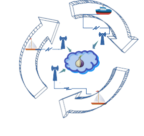
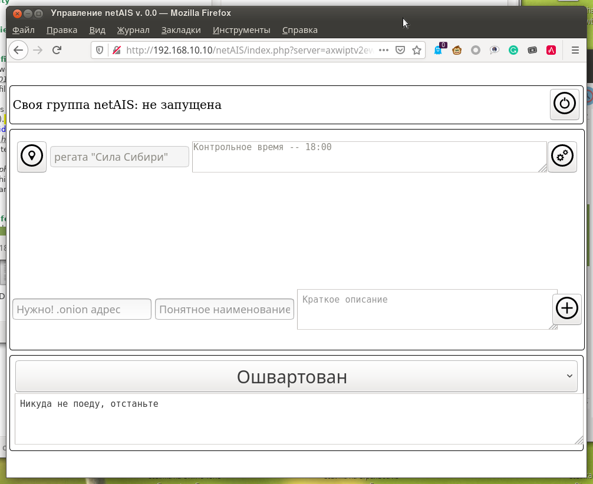
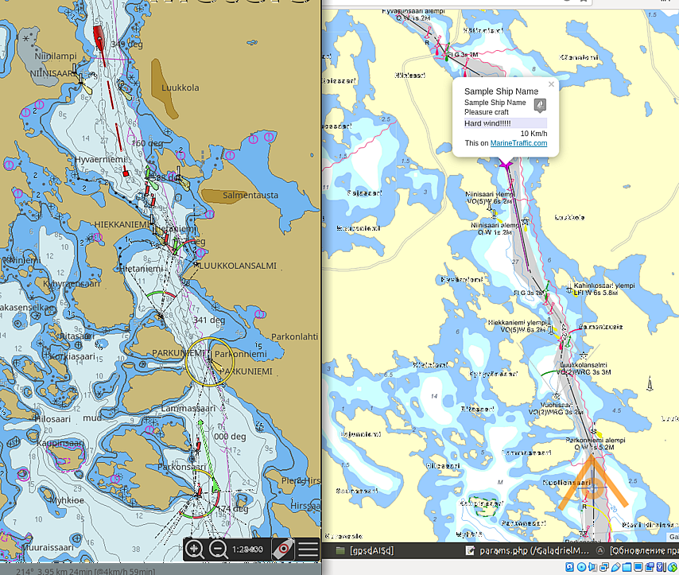

# netAIS 

## v. 0.0
Обмен AIS-подобными сообщениями с координатами и сопутствующей информацией через Интрнет между участниками выделенной группы. Для взаимодействия не требуется интернет-сервер с реальным адресом.

Удобно для организации коллективного плавания, соревнований, рыбалки.

   

Программное обеспечение использует [TOR](torproject.org) как среду коммуникации, и работает без дополнительных усилий через мобильный интернет и публичные точки доступа wi-fi .  

Предварительная версия не имеет стандартных выходных данных и интегрирована только с картплотером [GaladrielMap](http://galadrielmap.hs-yachten.at/). Но формат данных описан ниже, разумеется.

## Возможности
* Создание одной выделенной группы
* Участие в любом количестве выделенных групп
* Веб-интерфейс на русском и английском языках

## Технические детали
Комплект программного обеспечения содержит клиентскую часть -- собственно для обмена сообщениями, и серверную часть, обеспечивающую эту возможность. Один сервер обслуживает одну выделенную группу и является скрытым сервисом TOR.  Если вы хотите организовать собственную группу, .onion адрес этого сервиса надо передать потенциальным членам группы каким-нибудь сторонним способом -- в sms, электронной или голубиной почтой. Каждый член вашей группы указывает этот адрес в своём клиенте, и клиент получает возможность обмениваться информацией с сервером через сеть TOR. В адресах обычного интернета нет необходимости.

Клиент сохраняет полученные от сервера сведения обо всех членах группы в файл. Файл может независимо считываться каким-то другим программным обеспечением для отображения на экране.  
Информация в файле представляет собой закодированный в JSON ассоциированный массив, где ключ -- это mmsi плавсредства, а значение -- ассоциированный массив AIS характеристик, как они описаны в gpsd/www/AIVDM.adoc (если у вас установлен gpsd) или на сайте [e-Navigation Netherlands](http://www.e-navigation.nl/system-messages), за исключением:  

* Все единицы измерения приведены к общепринятым
* Метка времени является временем Unix

Формат файла идентичен аналогичному по назначению фалу в проекте  [gpsdAISd](https://github.com/VladimirKalachikhin/gpsdAISd), однако технические трудности не позволяют сразу использовать именно его. Но объединение информации из этих файлов не представляет сложности.

## Совместимость
Linux. 

## Зависимости
Требуется библиотека cURL и расширение php-curl -- для работы через TOR. К сожалению, замечательная функция _file_get_contents()_ не умеет socs proxy...

## Установка и конфигурирование:
На машине под управлением Linux должен быть установлен и сконфигурирован web сервер с поддержкой PHP и сервис [TOR service](https://2019.www.torproject.org/docs/tor-manual.html.en).  
Скопируйте файлы проекта в желаемый каталог web сервера и соответствующим образом исправьте пути в файле _params.php_.  
Установите права на запись в каталоги `data/` и `server/` для пользователя и/или группы web сервера (обычно это www-data).  
[Настройте скрытый сервис TOR](https://2019.www.torproject.org/docs/tor-onion-service.html.en) на каталог `server/`, если вы предполагаете держать свою выделенную группу. Если нет -- поднимать скрытый сервис нет необходимости.  
Если скрытый сервис сконфигурирован, укажите его адрес ,onion в переменной $onion файла _params.php_.  Адрес находится в файле `hostname` по пути, указанном в файле конфигурации TOR `torrs`. (Например, в Ubuntu .onion адрес можно узнать, сказав: `# cat /var/lib/tor/hidden_service_netAIS/hostname`, если скрытый сервис описан в `torrc` именно как hidden_service_netAIS)  
Если вы хотите новый .onion адрес для скрытого сервиса -- удалите содержимое каталога скрытого сервиса и перезапустите TOR. Во вновь появившемся файле `hostname` будет новый адрес.

### Информация о судне
Информация о вашем судне, передаваемая участникам группы, содержится в файле _boatInfo.ini_. Лучше заполнить его содержательно.

## Веб-интерфейс
   
Веб-интерфейс позволяет: 

* Включить - выключить обслуживание вашей выделенной группы (верхняя секция). Если обслуживание выключено, обращения к скрытому сервису TOR не приведут ни к какому результату. Но быть членом других групп вы сможете.
* Подключение к другим группам и создание нового подключения (средняя секция). Подключение к своей группе будет создано автоматически. Левая кнопка каждого подключения включает - выключает видимость группы для вас и вас для группы.
* Указать свой собственный статус, как он будет транслироваться участникам группы (нижняя секция).

Веб-интерфейс оптимизирован для мобильный устройств и устройств с экраном на электронных чернилах (e-Inc), в том числе и старых. Производительности от устройств не требуется.

## Благодарности
* [Metrize Icons by Alessio Atzeni](https://icon-icons.com/pack/Metrize-Icons/1130) за значки.

## Использование
netAIS является частью картплоттера [GaladrielMap](http://galadrielmap.hs-yachten.at/):
  

## Поддержка
За чашку кофе [через ЯндексДеньги](https://yasobe.ru/na/galadrielmap) или [PayPal](https://paypal.me/VladimirKalachikhin?locale.x=ru_RU) можно получить консультации по адресу [galadrielmap@gmail.com](mailto:galadrielmap@gmail.com)  